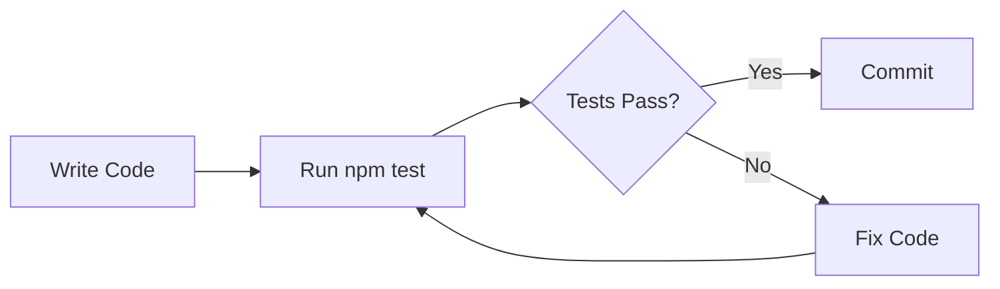
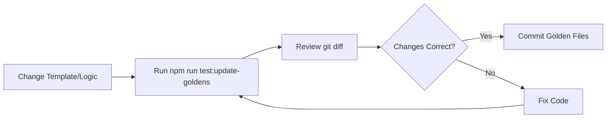

# Testing Documentation

## 📋 Overview

This project uses **Golden Testing** (also known as Snapshot Testing or Approval Testing) to verify that the Dart code generation from Firestore documents works correctly.

## 🎯 What are Golden Tests?

Golden tests compare the actual output of your code against a pre-approved "golden" reference file. If they match, the test passes. If they differ, the test fails.

**Benefits:**
- ✅ Catches unintended changes in generated code
- ✅ Makes code review easier (just review the golden file diff)
- ✅ Ensures consistent output across different environments
- ✅ Documents the expected output format

## 🧪 Test Suite

### Test Statistics

```
Test Suites: 2 passed, 2 total
Tests:       23 passed, 23 total
Time:        ~1.5s
```

### Coverage Report

```
File                 | % Stmts | % Branch | % Funcs | % Lines
---------------------|---------|----------|---------|--------
schema-analyzer.ts   |   74.13 |    60.62 |   82.6  | 75.75
dart-generator.ts    |   60.37 |    66.66 |   63.63 | 60.37
```

## 📁 Test Structure

```
test/
├── __golden__/                          # Golden reference files
│   ├── user_dto.golden.dart             # Expected output for User entity
│   ├── product_dto.golden.dart          # Expected output for Product entity
│   └── order_dto.golden.dart            # Expected output for Order entity
│
├── mocks/                               # Mock data
│   └── firestore-mocks.ts               # Firestore document mocks
│
├── dart-generator.golden.test.ts        # Golden tests
├── integration.test.ts                  # Integration tests
├── README.md                            # Test documentation
└── EXAMPLE_USAGE.md                     # Usage examples
```

## 🚀 Running Tests

### Basic Commands

```bash
# Run all tests
npm test

# Run tests in watch mode (re-runs on file changes)
npm run test:watch

# Run with coverage report
npm run test:coverage

# Update golden files (when you change generation logic)
npm run test:update-goldens
```

### Advanced Commands

```bash
# Run specific test file
npm test dart-generator.golden.test

# Run specific test case
npm test -- -t "should generate correct Dart model for users"

# Run with verbose output
npm test -- --verbose

# Run only integration tests
npm test integration.test
```

## 📝 Test Categories

### 1. Golden Tests (`dart-generator.golden.test.ts`)

Comprehensive tests that verify the entire code generation pipeline:

**User Entity Tests:**
- ✅ Generates UserDTO with required and optional fields
- ✅ Creates nested UserProfile class
- ✅ Creates nested UserMetadata class
- ✅ Handles DateTime fields correctly
- ✅ Handles arrays of primitives (tags)

**Product Entity Tests:**
- ✅ Generates ProductDTO with complex nested structures
- ✅ Creates ProductSpecifications nested class
- ✅ Creates ProductReview nested class for array items
- ✅ Handles arrays of objects
- ✅ Handles multiple DateTime fields

**Order Entity Tests:**
- ✅ Generates OrderDTO with deeply nested structures
- ✅ Creates OrderItem class for items array
- ✅ Creates OrderShippingAddress nested class
- ✅ Handles complex relationships

**Schema Analysis Tests:**
- ✅ Detects required vs optional fields correctly
- ✅ Detects field types (String, int, double, bool, DateTime)
- ✅ Creates nested classes for objects
- ✅ Creates item classes for arrays of objects
- ✅ Handles homogeneous typed lists

**Code Generation Feature Tests:**
- ✅ Includes Equatable import
- ✅ Generates fromJson factory constructor
- ✅ Generates toJson method
- ✅ Generates Equatable props
- ✅ Handles DateTime serialization/deserialization
- ✅ Adds null checks for optional fields in toJson

### 2. Integration Tests (`integration.test.ts`)

Real-world scenario tests:

- ✅ Simple Firestore document → Dart model
- ✅ Nested objects handling
- ✅ DateTime/Timestamp fields
- ✅ Arrays of primitives
- ✅ Arrays of objects
- ✅ Optional vs required field detection
- ✅ Complex e-commerce document structure
- ✅ Generated code syntax validation

## 🔄 Golden Test Workflow

### Normal Development



### Updating Generation Logic



## 📊 Example Test Flow

### Step 1: Mock Firestore Data

```typescript
const userDoc = createMockDocumentSnapshot('user123', {
  id: 'user123',
  name: 'John Doe',
  email: 'john@example.com',
  age: 30,
  isActive: true,
  createdAt: createTimestamp('2024-03-15T10:00:00Z'),
});
```

### Step 2: Analyze Schema

```typescript
const analyzer = new SchemaAnalyzer();
const schema = analyzer.analyzeDocuments('users', [userDoc]);
```

### Step 3: Generate Dart Code

```typescript
const generator = new DartGenerator();
const dartCode = generator.generateModel(schema);
```

### Step 4: Compare with Golden

```typescript
compareWithGolden('user_dto', dartCode);
```

## 🔍 What Gets Tested

### ✅ Covered

- [x] Type detection (String, int, double, bool, DateTime, List, Map)
- [x] Required vs optional field detection
- [x] Nullable field handling
- [x] Nested object class generation
- [x] Array of objects class generation
- [x] fromJson factory constructor
- [x] toJson method with null checks
- [x] Equatable implementation
- [x] DateTime serialization/deserialization
- [x] Field sorting (required first, then alphabetical)
- [x] Class naming (PascalCase with DTO suffix)
- [x] File naming (snake_case)

### ⚠️ Not Covered (Future Work)

- [ ] FirestoreClient (requires real Firebase connection)
- [ ] ConfigLoader (requires file system)
- [ ] CLI interface (requires process interaction)
- [ ] Barrel file generation
- [ ] Dart format execution

## 🐛 Troubleshooting

### Test Fails: "Golden file not found"

```bash
# Generate the missing golden file
npm run test:update-goldens
```

### Test Fails: Output doesn't match golden

```bash
# 1. Review the difference
npm test -- --verbose

# 2. If the change is intentional, update golden
npm run test:update-goldens

# 3. Review the diff
git diff test/__golden__/

# 4. If correct, commit
git add test/__golden__/*.golden.dart
git commit -m "chore: update golden files after template improvement"
```

### Tests Pass Locally but Fail in CI

**Common causes:**

1. **Golden files not committed**
   ```bash
   git status test/__golden__/
   git add test/__golden__/
   git commit -m "chore: commit golden files"
   ```

2. **Line ending differences (Windows vs Unix)**
   ```bash
   # Add to .gitattributes
   echo "*.dart text eol=lf" >> .gitattributes
   ```

3. **Different Node.js versions**
   - Ensure CI uses same Node.js version as locally
   - Check package.json engines field

## 📈 Improving Coverage

Current coverage: ~60-75% for core modules

**To improve:**

1. Add tests for edge cases in SchemaAnalyzer
2. Add tests for file writing in DartGenerator
3. Add integration tests for ConfigLoader
4. Add E2E tests with real Firebase (optional)

## 🎨 Adding New Tests

See [EXAMPLE_USAGE.md](test/EXAMPLE_USAGE.md) for detailed examples.

Quick template:

```typescript
describe('My New Feature', () => {
  it('should do something correctly', () => {
    // Arrange
    const documents = [createMockDocumentSnapshot('id', {...})];
    const analyzer = new SchemaAnalyzer();
    const generator = new DartGenerator();
    
    // Act
    const schema = analyzer.analyzeDocuments('collection', documents);
    const code = generator.generateModel(schema);
    
    // Assert
    expect(code).toContain('expected output');
    // or
    compareWithGolden('my_feature', code);
  });
});
```

## 📚 Resources

- **Test Documentation**: [test/README.md](test/README.md)
- **Usage Examples**: [test/EXAMPLE_USAGE.md](test/EXAMPLE_USAGE.md)
- **Jest Docs**: https://jestjs.io/
- **Golden Testing Pattern**: https://github.com/google/go-golden

## ✅ Pre-Commit Checklist

Before committing changes:

- [ ] Run `npm test` - all tests pass
- [ ] Run `npm run test:coverage` - coverage hasn't decreased
- [ ] If template changed, run `npm run test:update-goldens`
- [ ] Review `git diff test/__golden__/` - changes are intentional
- [ ] Update documentation if needed
- [ ] Tests are added for new features

## 🚢 CI/CD Integration

Tests run automatically on:
- Every push to any branch
- Every pull request
- Before deployment

**CI Configuration** (example for GitHub Actions):

```yaml
name: Tests
on: [push, pull_request]
jobs:
  test:
    runs-on: ubuntu-latest
    steps:
      - uses: actions/checkout@v3
      - uses: actions/setup-node@v3
        with:
          node-version: '18'
      - run: npm ci
      - run: npm test
      - run: npm run test:coverage
```

## 📝 Maintenance

### Weekly
- Review test coverage and aim to improve
- Check for flaky tests

### Monthly
- Update testing dependencies
- Review and refactor complex tests
- Add tests for reported bugs

### Per Release
- Ensure all tests pass
- Review golden files for unintended changes
- Update test documentation if needed

